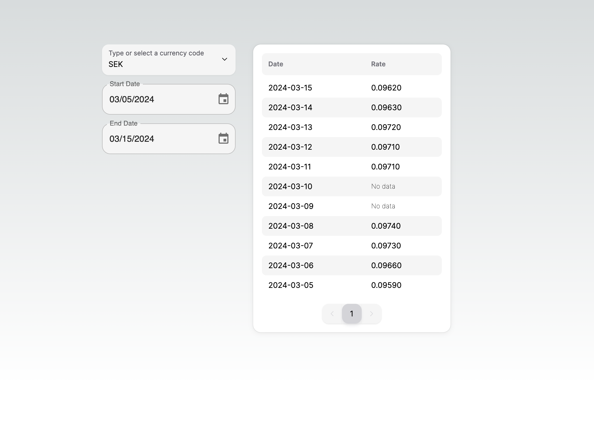

## Getting Started

First, create `.env` file with one line at the root of the project:

```
API_KEY=[apiKey]
```

API is from Alpha Vantage.

Then, run the development server:

```bash
npm i
npm run dev
```

## Answer to Requirements

### 1. API KEY

I used Alpha Vantage as requested. For today, the apikey you provide should still have left access times

### 2. Search Functionality

A select component with autocomplete function is used for this requirement. The default value set to SEK. All the possible currency codes are from Alpha Vantage, I turned them into an array of objects saved in `data.ts`.

### 3. Date Range Selection

I used two date picker component from MUI for this. You can either type in or select by click calendar icon.

I ususally use only one UI library for a project, NextUI is my choice for the most of time. But they don't have components for selecting dates, thus I install MUI and styled it.

### 4. Results Table

Selected currency code and dates are stored in app context. Based on Alpha Vantage API, you send one request to get all the history exchange rate of a currency by once, so I only request the data when the selected currency code changed, and then display the filtered data by selected dates.

### 5. Caching Mechanism

Before I use `TanStack` for the frontend caching, and build caching database for backend. For this fontend project, I was planning to use `TanStack` for caching as well. But I meet problem that it was not working as I wanted, so I build a backend point on the server side code so it can write the fetched data into files stored in `cachedRates` as caching.

If I have more time I could finish this function better. But for an 8 hours task, this is my functional solution.

### 6. Error Handling

For the user interface, I used the method like limiting the inputs to prevent from inputing error. For fetching errors, I display them in the console.log. Due to spend most of my time on caching mechanism, I don't have the chance to enhance the error handling further. But I think I did the basics.

### 7. Styling

I styled the components and color choices to make it looks appealing and intuitive. But I just run out of time for responsiveness.
